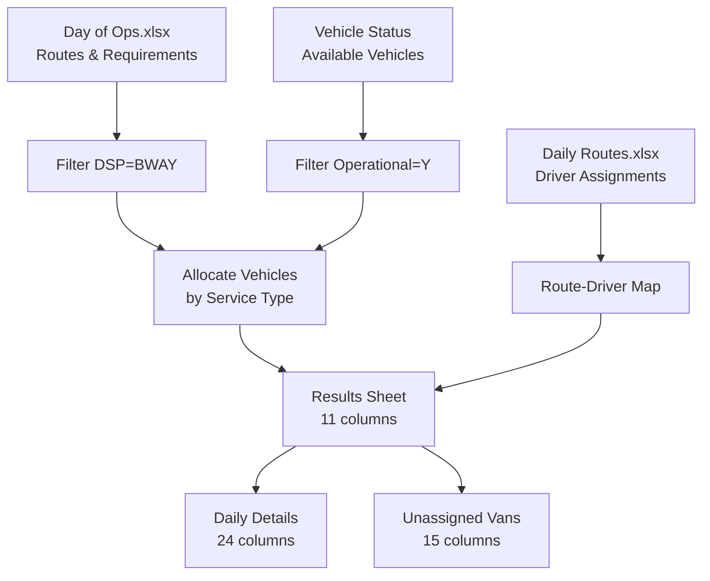

# Google Apps Script Allocation Flow Analysis

## Executive Summary
This document provides a comprehensive review of how the Google Apps Script uses Day of Ops and Daily Routes files to generate allocation results and update the Daily Details sheet.

## 📊 Input Files Structure

### 1. Day of Ops File (`DayOfOps.xlsx`)
**Sheet Name**: `Solution`

**Required Columns**:
- **Route Code**: Unique route identifier (e.g., "DUL4-5-001")
- **Service Type**: Type of service (determines vehicle type needed)
  - "Standard Parcel - Extra Large Van - US"
  - "Standard Parcel - Large Van"
  - "Standard Parcel Step Van - US"
  - "Nursery Route Level X"
- **DSP**: Delivery Service Provider (filtered for "BWAY" only)
- **Wave**: Departure time (e.g., "8:00 AM")
- **Staging Location**: Where vehicles stage (e.g., "STG.G.1")

**Purpose**: Defines all routes that need vehicle assignments for the day.

### 2. Daily Routes File (`DailyRoutes.xlsx`)
**Sheet Name**: `Routes`

**Required Columns**:
- **Route code**: Must match Route Code from Day of Ops
- **Driver name**: Name of the driver assigned to this route

**Purpose**: Maps drivers to specific routes.

### 3. Vehicle Status (Local to Daily Summary)
**Sheet Name**: `Vehicle Status`

**Required Columns**:
- **Van ID**: Unique vehicle identifier
- **Type**: Vehicle type ("Extra Large", "Large", "Step Van")
- **Opnal? Y/N**: Operational status (Y = available for assignment)

**Purpose**: Provides available vehicles for allocation.

## 🔄 Complete Allocation Flow

### Step 1: File Upload
```javascript
// User uploads two files via UploadDialog.html
1. Day of Ops XLSX File
2. Daily Routes XLSX File
```

### Step 2: Data Loading
```javascript
function mainAllocation(dayOfOpsId, dailyRoutesId) {
  // Load three data sources
  var dayOfOpsData = getSheetData(dayOfOpsId, "Solution");
  var vehicleStatusData = getSheetData(dailySummaryId, "Vehicle Status");
  var routesData = getSheetData(dailyRoutesId, "Routes");
}
```

### Step 3: Data Filtering
```javascript
// Filter for BWAY routes only
dayOfOpsObj = dayOfOpsObj.filter(r => r["DSP"] === "BWAY");

// Filter for operational vehicles only
var operationalFleet = fleetObj.filter(f => 
  f["Opnal? Y/N"] === "Y"
);
```

### Step 4: Vehicle Type Mapping
```javascript
function getVanType(serviceType) {
  var mapping = {
    "Standard Parcel - Extra Large Van - US": "Extra Large",
    "Standard Parcel - Large Van": "Large",
    "Standard Parcel Step Van - US": "Step Van"
  };
  
  // Special case for Nursery Routes
  if (serviceType.indexOf("Nursery Route Level") !== -1) {
    return "Large";
  }
}
```

### Step 5: Vehicle Allocation Algorithm
```javascript
function allocateVehiclesToRoutes(dayOfOpsObj, fleetObj) {
  // Group vehicles by type
  var fleetGroups = groupBy(operationalFleet, "Type");
  
  // For each route
  dayOfOpsObj.forEach(route => {
    // 1. Determine required vehicle type
    var requiredVanType = getVanType(route["Service Type"]);
    
    // 2. Check if vehicles available
    if (fleetGroups[requiredVanType].length > 0) {
      // 3. Assign first available vehicle of correct type
      var assignedVehicle = fleetGroups[requiredVanType].shift();
      
      // 4. Create allocation result
      var result = {
        "Route Code": route["Route Code"],
        "Service Type": route["Service Type"],
        "DSP": route["DSP"],
        "Wave": route["Wave"],
        "Staging Location": route["Staging Location"],
        "Van ID": assignedVehicle["Van ID"],
        "Device Name": assignedVehicle["Van ID"],
        "Van Type": assignedVehicle["Type"],
        "Operational": "Y",
        "Associate Name": "" // Added later
      };
    }
  });
}
```

### Step 6: Driver Assignment
```javascript
function updateResultsWithDailyRoutes(resultsSheetName, dailyRoutesObj) {
  // Build route -> driver mapping
  var routeMap = dailyRoutesObj.reduce((acc, r) => {
    acc[r["Route code"]] = r["Driver name"] || "N/A";
    return acc;
  }, {});
  
  // Update each allocation with driver name
  data.map(row => {
    var routeCode = row[0];
    var associateName = routeMap[routeCode] || "N/A";
    row[9] = associateName; // Associate Name column
    
    // Generate unique identifier
    var uniqueId = today + "|" + routeCode + "|" + associateName + "|" + vanId;
    row[10] = uniqueId;
  });
}
```

### Step 7: Results Sheet Creation
```javascript
// Create MM-DD-YY Results sheet with 11 columns:
1. Route Code
2. Service Type  
3. DSP
4. Wave
5. Staging Location
6. Van ID
7. Device Name
8. Van Type
9. Operational
10. Associate Name (from Daily Routes)
11. Unique Identifier
```

### Step 8: Daily Details Update
```javascript
function updateDailyDetails(resultsSheetName) {
  // For each row in Results
  for (var i = 1; i < resultsData.length; i++) {
    // Create new Daily Details row with 24 columns
    var newRow = Array(24).fill("");
    
    newRow[0] = today;                    // Date
    newRow[1] = routeCode;                // Route #
    newRow[2] = associateName;            // Name
    newRow[3] = deviceName;               // Asset ID
    newRow[4] = assignedVanId;            // Van ID
    newRow[5] = vehicleLogDict.vin;       // VIN (lookup)
    newRow[6] = vehicleLogDict.geoTab;    // GeoTab Code (lookup)
    newRow[7] = vehicleLogDict.type;      // Type (lookup)
    newRow[8] = vanType;                  // Vehicle Type
    newRow[9] = serviceType;              // Route Type
    // Columns 10-23 left empty for form updates
    newRow[21] = uniqueId;                // Unique Identifier
  }
  
  // Append to Daily Details (skip duplicates)
}
```

### Step 9: Unassigned Vehicles
```javascript
// Find vehicles not assigned
var unassignedVans = operationalFleet.filter(v => 
  !assignedVanIds.includes(v["Van ID"])
);

// Create MM-DD-YY Available & Unassigned sheet
```

## 🔑 Key Business Logic

### 1. Vehicle Type Matching
- Routes require specific vehicle types based on Service Type
- Only exact type matches are allowed (no substitutions)
- If no vehicle of required type available, route is skipped

### 2. Allocation Priority
- **First-Come-First-Served**: Vehicles assigned in order they appear in Vehicle Status
- **No Optimization**: Simple sequential matching, no distance/location optimization
- **Type Grouping**: Vehicles grouped by type before allocation

### 3. DSP Filtering
- **Only BWAY routes** are processed
- Other DSP routes are ignored completely

### 4. Operational Status
- **Only operational vehicles** (Opnal? Y/N = "Y") are considered
- Non-operational vehicles excluded from allocation pool

### 5. Unique Identifier Generation
```
Format: Date|Route|Driver|VanID
Example: "11/04/2024|DUL4-5-001|John Smith|VAN001"
```
- Prevents duplicate allocations
- Provides traceability

## 📈 Data Transformation Flow



## 🎯 Critical Implementation Points for Python

### 1. Must Maintain Service Type Mapping
```python
SERVICE_TYPE_TO_VAN_TYPE = {
    "Standard Parcel - Extra Large Van - US": "Extra Large",
    "Standard Parcel - Large Van": "Large",
    "Standard Parcel Step Van - US": "Step Van",
    # Special handling for Nursery Routes -> "Large"
}
```

### 2. Allocation Algorithm
```python
def allocate_vehicles_to_routes(routes, vehicles):
    # 1. Group vehicles by type
    vehicle_groups = group_by_type(vehicles)
    
    # 2. For each route (in order)
    for route in routes:
        required_type = get_van_type(route.service_type)
        
        # 3. Assign first available of correct type
        if vehicle_groups[required_type]:
            vehicle = vehicle_groups[required_type].pop(0)
            create_allocation(route, vehicle)
```

### 3. Must Generate Exact Column Structure
- Results: 11 columns in specific order
- Daily Details: 24 columns with exact headers
- Unique Identifier: Date|Route|Driver|VanID format

### 4. Duplicate Prevention
- Check unique identifiers before appending
- Skip rows that already exist in Daily Details

## 📝 Implementation Checklist

- [ ] Load Day of Ops file (Solution sheet)
- [ ] Load Daily Routes file (Routes sheet)
- [ ] Load Vehicle Status (or create from Vehicle Log)
- [ ] Filter for DSP = "BWAY"
- [ ] Filter for Operational = "Y"
- [ ] Map Service Types to Van Types
- [ ] Allocate vehicles by type (first-come-first-served)
- [ ] Map drivers from Daily Routes
- [ ] Generate unique identifiers
- [ ] Create Results sheet (11 columns)
- [ ] Update Daily Details (24 columns)
- [ ] Create Unassigned Vans sheet
- [ ] Handle duplicates
- [ ] Apply formatting (teal headers #46BDC6)

## 🚨 Important Notes

1. **No Optimization**: The GAS uses simple sequential matching, not optimization
2. **Strict Type Matching**: No vehicle substitutions allowed
3. **Order Matters**: Routes processed in order they appear
4. **Driver Optional**: Routes without drivers get "N/A"
5. **VIN Lookup**: VIN/GeoTab populated from Vehicle Log if available

This analysis provides the complete blueprint for implementing the exact GAS allocation logic in Python.